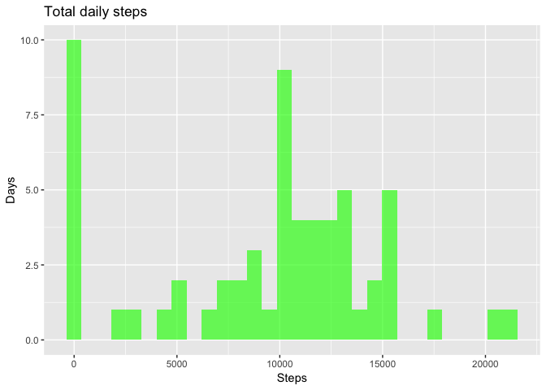
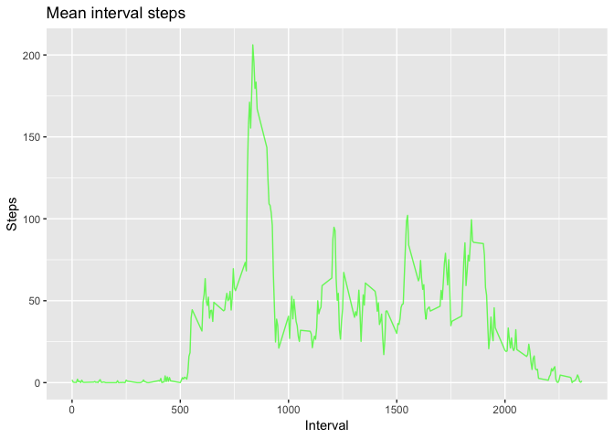
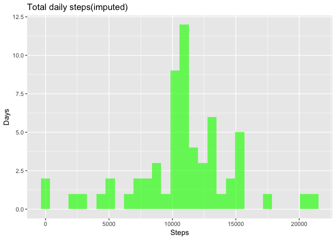
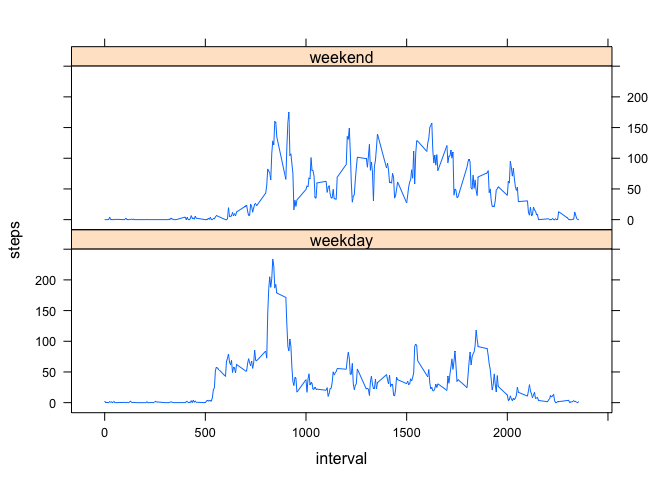

## Loading and preprocessing the data
Load data:

```r
data <- read.csv("activity.csv", header=TRUE, colClasses=c("numeric", "character", "numeric"))
```
Parse dates:

```r
data$date <- as.Date(data$date, "%Y-%m-%d")
```
Data sample:

```r
head(data)
```

```
##   steps       date interval
## 1    NA 2012-10-01        0
## 2    NA 2012-10-01        5
## 3    NA 2012-10-01       10
## 4    NA 2012-10-01       15
## 5    NA 2012-10-01       20
## 6    NA 2012-10-01       25
```
***

## What is mean total number of steps taken per day?
Load necessary libraries:

```r
library(ggplot2)
library(dplyr)
```
Calculate total step count for each date:

```r
meanStepsPerDay <- data %>%
  group_by(date) %>%
  summarise(steps=sum(steps, na.rm = TRUE))
```
Plot histogram of total daily step count: 

```r
g <- ggplot(data = meanStepsPerDay, aes(x=steps))
g + geom_histogram(fill="green", alpha=.65) + labs(title="Total daily steps", x="Steps", y="Days")
```

<!-- -->
  
Calculate summary statistics for total daily steps:

```r
summary(meanStepsPerDay$steps)
```

```
##    Min. 1st Qu.  Median    Mean 3rd Qu.    Max. 
##       0    6778   10395    9354   12811   21194
```
***


## What is the average daily activity pattern?
Calculate average step count for each interval (across all dates):

```r
meanStepsPerInterval <- data %>%
  group_by(interval) %>%
  summarise(steps=mean(steps, na.rm = TRUE))
```
Plot mean interval steps series:

```r
g <- ggplot(meanStepsPerInterval, aes(x=interval, y=steps))
g + geom_line(col="green", alpha=.65) + labs(title="Mean interval steps", x="Interval", y="Steps")
```

<!-- -->
  
Find interval with maximal average number of steps (across all dates):

```r
meanStepsPerInterval$interval[which.max(meanStepsPerInterval$steps)]
```

```
## [1] 835
```
Average steps count for this interval:

```r
meanStepsPerInterval$steps[which.max(meanStepsPerInterval$steps)]
```

```
## [1] 206.1698
```
***


## Imputing missing values
Total number of NA records:

```r
sum(is.na(data$steps))
```

```
## [1] 2304
```
Define imputing policy for missing values in data set (set equal to a mean for an interval):

```r
impute <- function(data, meanStepsPerInterval) {
  result <- data.frame(data)
  for (i in seq(1, dim(result)[1])){
    if(!is.na(result[i, "steps"])) {
      next
    }
    interval <- result[i, "interval"]
    result[i, "steps"] <- meanStepsPerInterval[meanStepsPerInterval$interval == interval, "steps"]
  }
  return(result)
}
```
<!-- Create a new dataset that is equal to the original dataset but with the missing data filled in. -->
Impute NA values and create separate data frame for obtained data:

```r
imputedData <- impute(data, meanStepsPerInterval)
```
Number of NAs on imputed data:

```r
sum(is.na(imputedData$steps))
```

```
## [1] 0
```
Calculate total step count for each date on imputed data:

```r
imputedMeanStepsPerDay <- imputedData %>%
  group_by(date) %>%
  summarise(steps=sum(steps, na.rm = TRUE))
```
Plot histogram of total daily step count for imputed data: 

```r
g <- ggplot(data = imputedMeanStepsPerDay, aes(x=steps))
g + geom_histogram(fill="green", alpha=.65) + labs(title="Total daily steps(imputed)", x="Steps", y="Days")
```

<!-- -->
  
Calculate summary statistics for total daily steps(imputed):

```r
summary(imputedMeanStepsPerDay$steps)
```

```
##    Min. 1st Qu.  Median    Mean 3rd Qu.    Max. 
##      41    9819   10766   10766   12811   21194
```
Original statistics on unemputed data:

```r
summary(meanStepsPerDay$steps)
```

```
##    Min. 1st Qu.  Median    Mean 3rd Qu.    Max. 
##       0    6778   10395    9354   12811   21194
```
Both mean and median increased for imputed data.
***


## Are there differences in activity patterns between weekdays and weekends?
Add weekday/weekend mark to data:

```r
data$weekPart <- factor(ifelse(weekdays(data$date) == "Sunday" | weekdays(data$date) == "Saturday", "weekend", "weekday"))
```
Calculate average interval step counts for weekday/weekend:

```r
meanStepsPerWeekPart <- data %>%
  group_by(interval, weekPart) %>%
  summarise(steps = mean(steps, na.rm = TRUE))
```
Plot average interval step count series for weekdays/weekends:

```r
library(lattice)
xyplot(steps ~ interval|weekPart, meanStepsPerWeekPart, layout=c(1,2), type="l")
```

<!-- -->

